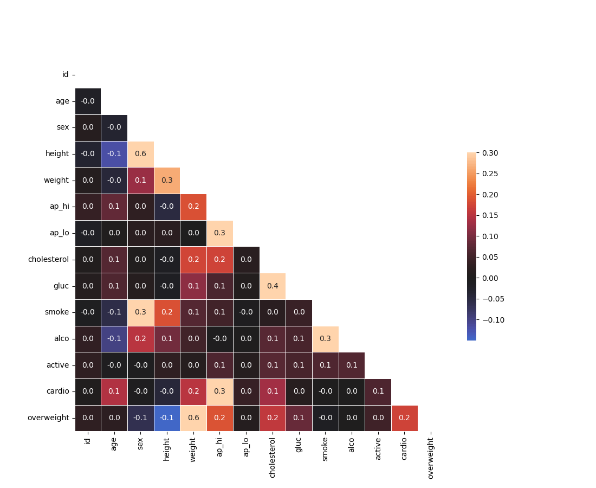

# Medical Data Visualizer

[Evan Sherwood](https://github.com/Alanwatts42)

This is my forked version of the *Medical Data Visualizer* project, which is part of the "Data Analysis with Python" course on FreeCodeCamp.com. This version contains my additions to the primary python file medical_data_visualizer.py. Once I can run this project and pass the unit tests, I'll be submitting it for review so I can complete the course.

<br>
<br>
<br>

# Project Instructions

Visualize and make calculations from medical examination data using `matplotlib`, `seaborn`, and `pandas`. Dataset values were collected during medical examinations.

<br>


### **Data Description**: <br>

The rows represent patients and the columns represent information like body measurements, results from various blood tests, and lifestyle choices. You will use the dataset to explore the relationship between cardiac disease, body measurements, blood markers, and lifestyle choices.

<br>
<br>

### Variables
---


| Feature | Variable Type | Variable | Value Type |
| -- | -- | -- | -- | 
| Age | Objective Feature | `age` | int (days) |
| Height | Objective Feature | `height` | int (cm) |
| Weight | Objective Feature | `weight` | weight (kg) | 
| Gender | Objective Feature | `gender` | categorical code |
| Systolic blood pressure | Examination Feature | `ap_hi` | int |
| Diastolic blood pressure | Examination Feature | `ap_lo` | int |
| Cholesterol | Examination Feature | `gluc` | 1: Normal, 2: Above Normal, 3: Well Above Normal |
| Smoking | Subjective Feature | `smoke` | binary |
| Alcohol Intake | Subjective Feature | `alco` | binary |
| Physical Activity | Subjective Feature | `active` | binary |
| Presence or absence of cardiovascular disease | Target Variable | `cardio` | binary |


<br>
<br>
<br>


---


FreeCodeCamp Project Instructions: <br>[https://www.freecodecamp.org/learn/data-analysis-with-python/data-analysis-with-python-projects/medical-data-visualizer](https://www.freecodecamp.org/learn/data-analysis-with-python/data-analysis-with-python-projects/medical-data-visualizer)

Project Replit Link: <br>
[https://replit.com/@Alanwatts42/boilerplate-medical-data-visualizer](https://replit.com/@Alanwatts42/boilerplate-medical-data-visualizer)

<br>
<br>
<br>


# Project Plots:

### Imports and Data Normalization:
```python
#!/usr/bin/env python3
import pandas as pd
import seaborn as sns
import numpy as np
import matplotlib.pyplot as plt
# 1 - Import the data from medical_examination.csv and assign it to the df variable
df = pd.read_csv('medical_examination.csv')
# 2 - Create the overweight column in the df variable
df['overweight'] =(df['weight'] / (df['height'] / 100) ** 2).apply(lambda x: 1 if x > 25 else 0)
# 3 - Normalize data by making 0 always good and 1 always bad. If the value of cholesterol or gluc is 1, set the value to 0. If the value is more than 1, set the value to 1
df['cholesterol'] = df['cholesterol'].apply(lambda x: 0 if x == 1 else 1)
df['gluc'] = df['gluc'].apply(lambda x: 0 if x == 1 else 1)
```

<br>

### Category Plot Function:
```python
def draw_cat_plot(): 
    # 5 - Create a DataFrame for the cat plot using pd.melt with values from cholesterol, gluc, smoke, alco, active, and overweight in the df_cat variable.
    df_cat = pd.melt(id_vars = ['cardio'] , value_vars =  ['cholesterol', 'gluc', 'smoke', 'alco', 'active', 'overweight'], frame = df)
    df_cat['total'] = 0
    # 6 - Group and reformat the data to split it by 'cardio'. Show the counts of each feature. You will have to rename one of the columns for the catplot to work correctly.
    df_cat = df_cat.groupby(['cardio', 'variable', 'value']).count().reset_index()
    # 7 - Draw the catplot with 'sns.catplot()'
    result_catplot = sns.catplot(data = df_cat, x = 'variable', y = 'total', hue = 'value', col ='cardio', kind ='bar')
    # 8 - Get the figure for the output
    fig = result_catplot.figure
    # 9 - Do not modify the next two lines
    fig.savefig('catplot.png')
    return fig
```


### Category Plot:


<br>


### Heat Map Function:
```python
# 10 - Draw the Heat Map in the draw_heat_map function
def draw_heat_map(): 
    # 11 - Clean the data
    # diastolic pressure is higher than systolic (Keep the correct data with (df['ap_lo'] <= df['ap_hi']))
    df_heat = df[(df['ap_lo'] <= df['ap_hi']) & (df['height'] >= df['height'].quantile(0.025))]
    # height is less than the 2.5th percentile (Keep the correct data with (df['height'] >= df['heigth'].quantile(0.025)))
    df_heat = df_heat[df_heat['height'] <= df_heat['height'].quantile(0.975)]
    # weight is less than the 2.5th percentile
    df_heat = df_heat[(df_heat['weight'] >= df_heat['weight'].quantile(0.025))]
    # weight is more than the 97.5th percentile
    df_heat = df_heat[df_heat['weight'] <= df_heat['weight'].quantile(0.975)]
    # 12 - Calculate the correlation matrix
    corr = df_heat.corr()
    # 13 - Generate a mask for the upper triangle
    mask = np.triu(corr)
    # 14 - Set up the matplotlib figure
    fig, ax = plt.subplots(figsize=(11, 9))
    # 15 - Draw the heatmap with 'sns.heatmap()'
    sns.heatmap(
        corr, 
        mask=mask, 
        annot=True, 
        fmt='.1f', 
        linewidths=.5, 
        vmax=.3, 
        center=0, 
        square=True, 
        cbar_kws={'shrink': .5}
        )
    # 16 - Do not modify the next two lines
    fig.savefig('heatmap.png')
    return fig
```

## Heat Map:


<br>




<br>


